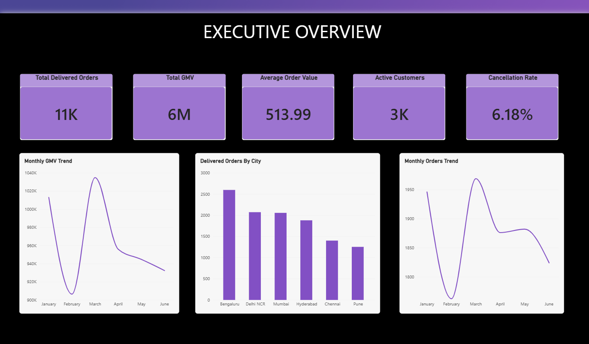
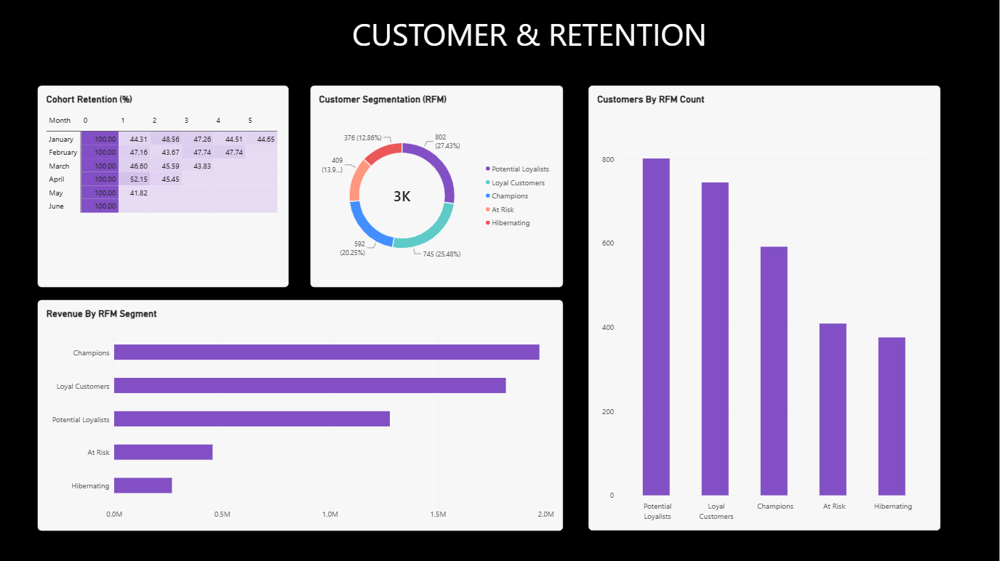
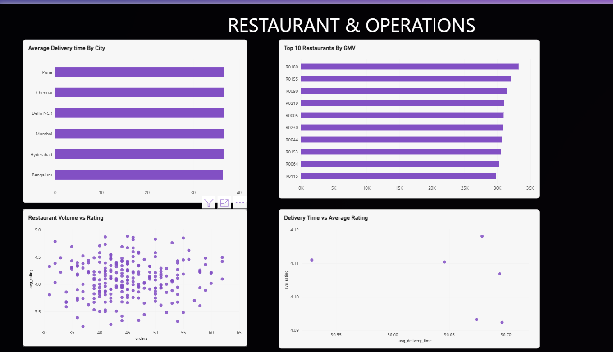
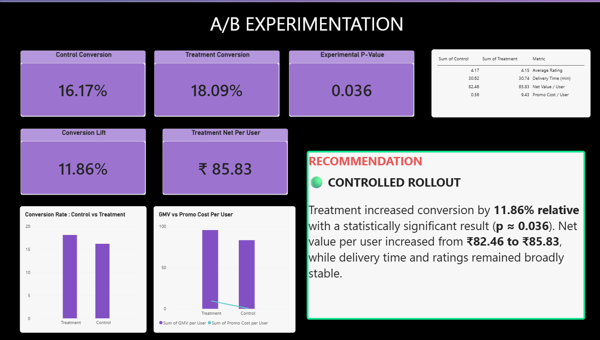

# Food Delivery Product Analytics & Experimentation

End-to-end product analytics project inspired by a food-delivery platform such as Zomato. The project analyzes order performance, customer behavior, retention, restaurant operations, and an A/B experiment to generate actionable product insights.

## 🎯 Business Objective

The objective is to understand:

- How the food-delivery business is performing across cities and months
- Which customer segments drive the most revenue
- How customer retention changes across cohorts
- Which cities and restaurants require operational attention
- Whether a promotional intervention improves customer conversion
- Whether the increase in conversion creates enough incremental value to justify the promotional cost

---

## 🛠️ Tools & Technologies

- **Python** — Pandas, NumPy, Matplotlib, SciPy
- **SQL** — SQLite
- **Power BI** — Dashboarding, KPI reporting and visualization
- **Jupyter Notebook** — Exploratory and statistical analysis

---

## 📊 Key Business KPIs

| KPI | Result |
|---|---:|
| Delivered Orders | 11,259 |
| Delivered GMV | ₹57.87 L |
| Average Order Value | ₹513.99 |
| Customers | 2,937 |
| Cancellation / Rejection Rate | 6.18% |

---

## 🔍 Analysis Performed

### 1. Executive Overview

Analyzed monthly business performance and city-level order distribution using:

- GMV trends
- Order trends
- Average Order Value
- Active customers
- Cancellation rate
- Orders by city

### 2. Customer Segmentation & Retention

Applied **RFM (Recency, Frequency, Monetary) analysis** to segment customers into:

- Champions
- Loyal Customers
- Potential Loyalists
- At Risk
- Hibernating

Cohort analysis was also performed to understand customer retention over time.

### 3. Restaurant & Operations Analysis

Evaluated:

- Delivery time by city
- Customer ratings vs delivery time
- Restaurant order volume
- Restaurant GMV
- Restaurant-level performance

This helped identify operational patterns and high-value restaurants.

### 4. A/B Experimentation

Evaluated a promotional intervention using Control and Treatment groups.

| Metric | Control | Treatment |
|---|---:|---:|
| Conversion Rate | 16.17% | 18.09% |
| Relative Conversion Lift | — | **11.86%** |
| P-value | — | **0.036** |
| GMV / User | ₹83.01 | ₹95.26 |
| Promo Cost / User | ₹0.56 | ₹9.43 |
| Net Value / User | ₹82.46 | **₹85.83** |

### Experiment Result

The treatment increased conversion from **16.17% to 18.09%**, representing an **11.86% relative lift**.

The experiment produced a statistically significant result (**p ≈ 0.036**).

Although promotional cost increased substantially, net value per user also increased from **₹82.46 to ₹85.83**.

### Product Recommendation

**Controlled rollout recommended**, subject to validating contribution margin and monitoring promotional efficiency before a full-scale rollout.

---

# 📈 Dashboard Preview

## Executive Overview



## Customer & Retention



## Restaurant & Operations



## A/B Experimentation



---

## 📁 Project Structure

```text
Food_delivery_product_analytics/
│
├── data/
│   └── ...
│
├── screenshots/
│   ├── page-1.png
│   ├── page-2.png
│   ├── page-3.png
│   └── page-4.png
│
├── README.md
├── analysis.sql
├── experiment_results.csv
├── orders.csv
├── pb.pbix
├── product_analytics.ipynb
└── requirements.txt
```
## 💡 Key Product Insights

- **Bengaluru is the largest order-volume market**, contributing the highest number of delivered orders among the analyzed cities.
- **Champions and Loyal Customers are the highest-value segments**, together contributing a substantial share of total revenue and representing the strongest retention opportunity.
- **Customer retention drops sharply after the first month**, with Month-1 retention ranging around 42–52% across cohorts, highlighting an opportunity for stronger early-life-cycle engagement.
- **Delivery time is relatively consistent across cities (~36–37 minutes)**, and the analysis does not show a strong direct relationship between delivery time and customer ratings.
- **A/B testing showed a statistically significant conversion improvement**: Treatment conversion increased from **16.17% to 18.09%**, an **11.86% relative lift** with **p ≈ 0.036**.
- **The treatment increased GMV per user from ₹83.01 to ₹95.26**, but also increased promotional cost per user from **₹0.56 to ₹9.43**.
- **Net value per user still improved from ₹82.46 to ₹85.83**, suggesting the promotion has positive economic potential, subject to contribution-margin validation.
- **Product opportunity:** prioritize high-value customer retention, targeted reactivation of at-risk users, city-level operational optimization, and targeted promotions rather than broad discounting.
